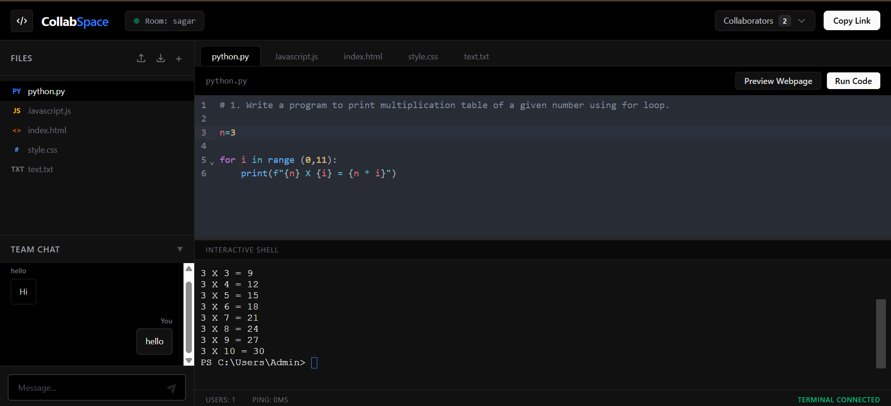

# CollabSpace 🚀
**[🔴 Try the Live Demo Here!](https://collab-space-two.vercel.app)**

A premium real-time collaborative Cloud IDE. CollabSpace allows multiple developers to write, sync, and execute code simultaneously in secure, isolated rooms. It features a fully integrated, interactive pseudo-terminal powered by native OS bindings.

## ✨ Key Features

*   **Real-Time Collaboration:** Millisecond-latency code syncing across multiple clients using CRDTs (Yjs) and WebSockets.
*   **Interactive Cloud Terminal:** A fully functional, interactive shell (`node-pty` + `xterm.js`) allowing users to execute scripts, install packages, and navigate the file system directly from the browser.
*   **Smart Execution Engine:** Instantly run Python and JavaScript files with a single click, piping outputs and errors to the shared terminal.
*   **Secure Workspaces:** Create password-protected rooms with global ownership verification and auto-saving file states.
*   **Live Web Preview:** Dynamically compile HTML/CSS/JS files into Blob URLs for instant front-end web rendering.

## 🛠️ Tech Stack

*   **Frontend:** React, Vite, Tailwind CSS, Framer Motion
*   **Editor & UI:** CodeMirror 6, Xterm.js
*   **Backend:** Node.js, Express
*   **Real-Time & Sync:** Socket.io, Yjs (Conflict-free Replicated Data Types)
*   **System Bindings:** Node-pty (Pseudo-terminal execution)
*   **Database:** MongoDB, Mongoose (User Auth & Room State)

## ⚙️ Prerequisites

Because this project utilizes native C++ bindings for the interactive terminal, specific build tools are required depending on your OS.

**For Windows 11 Environments:**
*   Python 3.10+ (Installed via Microsoft Store)
*   Visual Studio 2022 C++ Build Tools (Specifically `MSVC v143` and `Windows 11 SDK`)

## 🚀 Local Setup

**1. Clone the repository**
\`\`\`bash
git clone https://github.com/your-username/CollabSpace.git
cd CollabSpace
\`\`\`

**2. Setup the Backend Server**
\`\`\`bash
cd collab-server
npm install
\`\`\`
Create a `.env` file in the `collab-server` directory:
\`\`\`env
PORT=5000
MONGO_URI=your_mongodb_connection_string
JWT_SECRET=your_secure_secret_key
\`\`\`
Start the server:
\`\`\`bash
npm start
\`\`\`

**3. Setup the Frontend Client**
Open a new terminal tab:
\`\`\`bash
cd collab-editor
npm install
npm run dev
\`\`\`

## 💡 Usage
Navigate to `http://localhost:5173`. Create an account, generate a secure Room ID, and share it with collaborators to start building together!